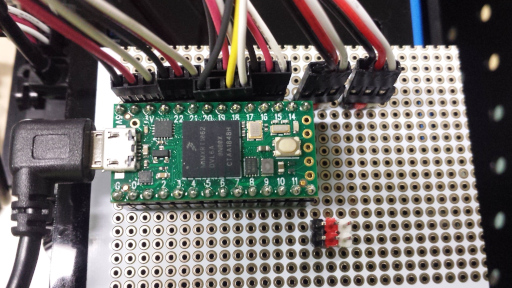
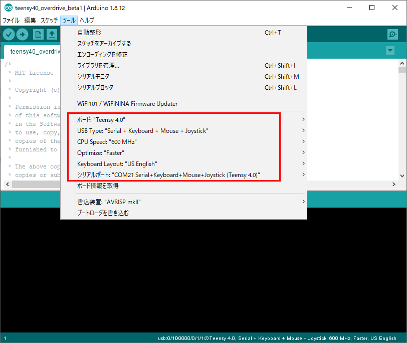
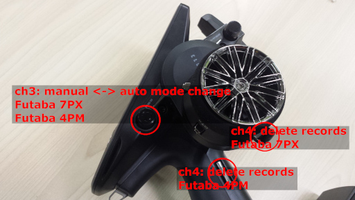
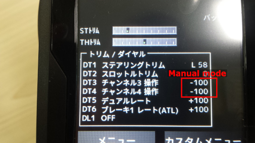
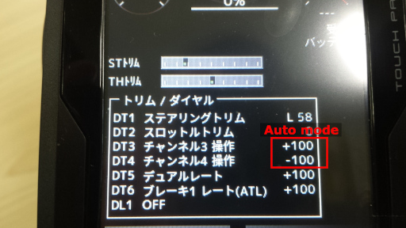
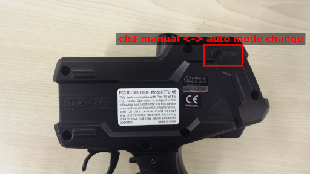
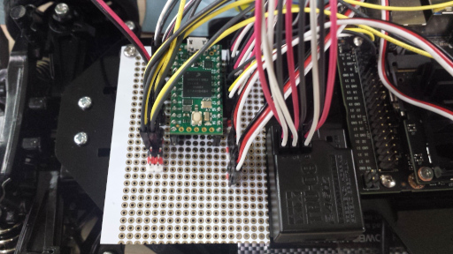

# OVERDRIVE

Teensy 4.0 RC/LED Controller



## Requirement for rc car autonomous driving
* Teensy 4.0
* 4ch or 3ch rc receiver/transmitter (test with Futaba R334SBS-E/Futaba 7PX)
* Jetson Nano (I don't test on raspberry pi3/4.)

<hr>

## Requirement for rc car led decolation
* Teensy 4.0
* 4ch or 3ch rc receiver/transmitter
* USB mobile battery
* 5V 20mA single connected LEDs. (for beta1)

## Youtube
[](https://www.youtube.com/watch?v=BgRjPW4X-rY)

<hr>

## Known issue
* sometime i2c error occures with PCA9685 emulator.<br>
* Some motors seem to be affected by noise. (maybe tired motor)<br>
  * If you feels bad signal with throttle on, try polishing the commutator and brush of the motor.<br>

<hr>

## Teensy Setup
[Arduino IDE](https://www.arduino.cc/en/main/software)<br>
[Teensyduino](https://www.pjrc.com/teensy/td_download.html)<br>
[teensy4_i2c](https://github.com/Richard-Gemmell/teensy4_i2c)<br>
* Install Arduino IDE.
* Install Teensyduino.
* Install teensy4_i2c.
* Setup Arduino IDE

### Install Arduino IDE.
Download ARDUINO 1.8.12 Windows ZIP file for non admin install.<br>
unzip it.<br>

### Install Teensyduino.
Download Teensyduino 1.51 Windows XP/7/8/10 Installer.<br>
execute and install.<br>

### Install teensy4_i2c.
git clone and copy the directory into arduino libraries.<br>
```
git clone https://github.com/Richard-Gemmell/teensy4_i2c
cp -r teensy4_i2c arduino/hardware/teensy/avr/libraries/
```

### Setup Arduino IDE
* Tools
Board: "Teensy 4.0"<br>
USB Type: "Serial + Keyboard + Mouse + Joystick"<br>
CPU Speed: "600 MHz"<br>
Optimize: "Faster"<br>


<hr>

## DonkeyCar Setup
* donkeycar 3.1.5 overdrive for rc car
* donkeycar 3.1.5 overdrive simulator

<hr>

### donkeycar 3.1.5 overdrive for rc car
on training PC:
```
mkdir ~/projects
cd ~/projects
git clone https://github.com/naisy/donkeycar
cd donkeycar
git checkout overdrive
pip install -e .[pc]
donkey createcar --path ~/mycar
```
on Jetson Nano:
```
mkdir ~/projects
cd ~/projects
git clone https://github.com/naisy/donkeycar
cd donkeycar
git checkout overdrive
pip install -e .[nano]
donkey createcar --path ~/mycar
```
and use myconfig.py
```
cd ~/projects
git clone https://github.com/naisy/overdrive
cp overdrive/donkeycar_overdrive/car/cfg* ~/mycar
```
Manual driving and recording.<br>
(see also 4ch Transmitter Settings)
```
python manage.py drive --js --myconfig=cfg_manual.py
```
Autonomous driving.
```
python manage.py dirve --model=mylinear.h5 --myconfig=cfg_auto.py
```

<hr>

### donkeycar 3.1.5 overdrive simulator
Requirements: Experience installing donkeycar simulator.<br>
donkeycar_sim-racer directory in this repo will be delete. Because I created overdrive branch in my forked donkeycar repo.

```
cd ~/projects
git clone https://github.com/naisy/donkeycar
cd donkeycar
git checkout overdrive
pip install -e .[pc]
donkey createcar --path ~/sim_racer
```
and use myconfig.py
```
cd ~/projects
git clone https://github.com/naisy/overdrive
cp overdrive/donkeycar_overdrive/sim/cfg* ~/sim_racer
```
Manual driving and recording.<br>
This config has constant throttle assist. (JOYSTICK_ADD_THROTTLE = 0.3)<br>
```
python manage.py drive --js --myconfig=cfg_manual_server.py
```
Autonomous driving.
```
python manage.py dirve --model=myrnn.h5 --myconfig=cfg_auto_server.py
```

You need to edit these lines before the race.
```
GYM_CONF = { "body_style" : "donkey", "body_rgb" : (128, 128, 128), "car_name" : "car", "font_size" : 100}
GYM_CONF["racer_name"] = "Your Name"
GYM_CONF["country"] = "USA"
GYM_CONF["bio"] = "I race robots."
GYM_CONF["guid"] = "00000000-0000-4000-0000-000000000000"
```

#### Old function
Assist recording.<br>
`The fusion of Human and AI has failed. AI has been found to be very original and using this feature will prevent human driving.`

Create and use speed30 model.<br>
Steering: user steering.<br>
Throttle: user throttle + ai throttle.<br>
```
python manage.py drive --js --model=mylinear.h5 --myconfig=cfg_assist_server.py
.py
```
Assist data generate.
```
wget https://raw.githubusercontent.com/naisy/donkeycar_tools/master/make_ai_to_train_data.py
python make_ai_to_train_data.py
mv data data_assist_org
mv data_ai data
python train.py --model=mylinear2.h5 --type=linear
```

<hr>

## 4ch Transmitter Settings
Steering and throttle: These are normal rc car setting.<br>
* ch1
  * steering
* ch2
  * throttle
* ch3
  * manual - auto mode change.
* ch4
  * delete record.

Futaba 7PX<br>
<br>
<br>
<br>

<hr>

## 3ch Transmitter Settings
Steering and throttle: These are normal rc car setting.<br>
* ch1
  * steering
* ch2
  * throttle
* ch3
  * manual - auto mode change.

Tamiya TTU-08 (FINESPEC 2.4G)<br>
<br>
## 3ch Wireing
<br>

## Record training data
* Transmitter ch3 auto mode.
* Transmitter ch3 manual mode. (change from auto to manual mode is one of flags)
* Transmitter ch2 throttle on. (start recording)
* Transmitter ch3 auto mode. (stop recording)
* Transmitter ch4 delete records. (delete 120 records.)

## Autonomous driving
* Transmitter ch3 auto mode.<br>
If you think your rc car will crash, apply the brakes immediately. Overdrive gives priority to manual operation.<br>
One second after you release your hand, it switches to automatic mode.<br>

<hr>

## Teensy 4.0 OVERDRIVE beta1
See [Teensy 4.0 OVERDRIVE beta1](./README_teensy40_overdrive_beta1.md)<br>

<hr>

## ROADMAP
### Teensy 4.0 OVERDRIVE beta2 (in 2020)
* Breadboard
  * LED update. Add more LEDs.
* I2C
  * Add new virtual I2C device for RC control instead of PCA9685 emulator. It will be optimized for the RC setting more than PCA9685.
* Support high speed digital servo. (Manual mode in beta1 is already optimized. But PCA9685 mode is not optimized yet.)
