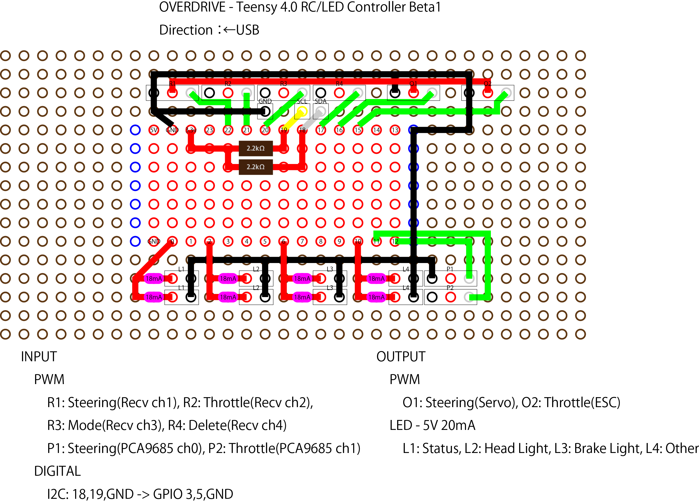
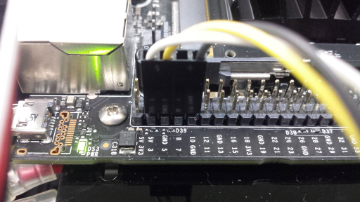
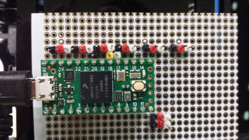
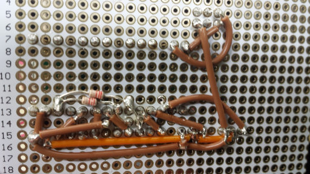

# Teensy 4.0 OVERDRIVE beta1

## Breakout Board
<br>

## Code
[teensy40_overdrive_beta1/teensy40_overdrive_beta1.ino](./teensy40_overdrive_beta1/teensy40_overdrive_beta1.ino)

## Wiring
<br>
<br>
<br>
<br>

## Tuning
Using an oscilloscope, enter the time (in microseconds) during which the voltage is HIGH.<br>
<b>Important:</b><br>
* MIN is minimum pulse. You can forget which is left, right, forward, brake.</b>
* Enter only the neutral pulse exactly. Only 2 microseconds of neutral error is allowed to support delicate control and high power rc car. The correct neutral shows 0.0 as Joystick value. You can also use DEBUG 1 to see the pulses using a serial monitor.<br>
* MIN and MAX are 1000 and 2000 (us), unless facing obvious problems. However, neutral should be set really accurately. If neutral is perfect, the autonomous driving can reproduce the slowest possible driving with high power motor.<br>

source: [teensy40_overdrive_beta1.ino](teensy40_overdrive_beta1/teensy40_overdrive_beta1.ino)
```
/* STEERING PULSE */
const int RECV_CH1_PULSE_LENGTH_MIN     = 1000; // maximum steering right value
const int NEUTRAL_STEERING_PULSE_LENGTH = 1509; // neutral steering value
const int RECV_CH1_PULSE_LENGTH_MAX     = 2000; // maximum steering left value

/* THROTTLE PULSE */
const int RECV_CH2_PULSE_LENGTH_MIN     = 1000; // maximum throttle forward value
const int NEUTRAL_THROTTLE_PULSE_LENGTH = 1520; // neutral throttle value
const int RECV_CH2_PULSE_LENGTH_MAX     = 2000; // maximum throttle brake value
```
If you use reversed throttle, then set REVERSE 1. (default 0)
```
#define REVERSE 1              // TS-50A ESC should be 1. This uses only for led controll.
```
If you want to use PCA9685 board, then set USE_PCA9685_EMULATOR 0 and use P1/P2 pin. (default 1)
```
#define USE_PCA9685_EMULATOR 0
```

source: [myconfig.py](donkeycar311/myconfig.py.nano_120fps)
```
THROTTLE_FORWARD_PWM = 250       # 1000us
THROTTLE_STOPPED_PWM = 375       # 1520us?
THROTTLE_REVERSE_PWM = 500       # 2000us
```

